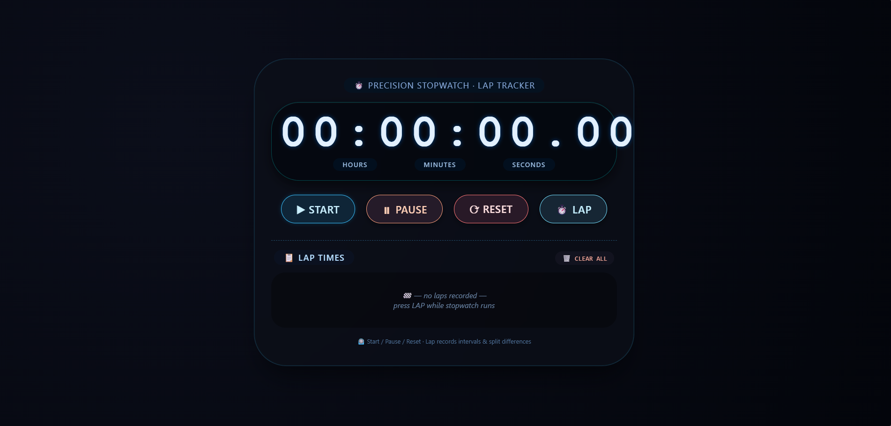
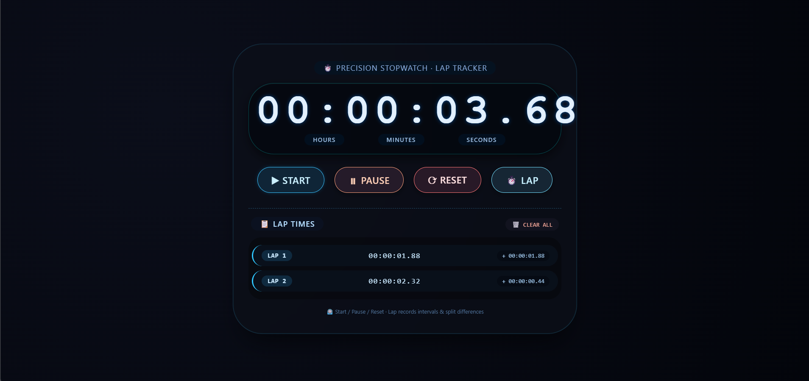

# ⏱️ Precision Stopwatch – Lap Timer Web App  

## 📌 Overview  
A modern **Stopwatch Web App** built during my **Web Development Internship at SkillCraft Technology (Task 02 – SCT_WD_2)**.  
It enables accurate time tracking with lap & split features and a clean glassmorphism UI.  

---

## 🖼️ Interface Preview  
<p align="center">
  
   
</p>

---

## 🎯 Features  
- ⏱️ Start, Pause, Reset  
- 🧮 High-precision timing (HH:MM:SS.CS)  
- 📋 Lap & split tracking  
- 🗑️ Clear laps  
- 🎨 Glassmorphism UI  
- 📱 Responsive design  

---

## 🛠️ Tech Stack  
- HTML5  
- CSS3  
- JavaScript  

---

## 🚀 Run Locally  
```bash
git clone https://github.com/ksakshay2004-lang/SCT_WD_2.git
```
Open `index.html` in your browser  

---

## 📂 Project Structure  
```
SCT_WD_2/
├── index.html
├── README.md
├── screenshots/
│   └── appinterface1.png
```

---

## 👨‍💻 Author  
**Akshay K S**  
📧 ksakshay2004@gmail.com  
🔗 https://github.com/ksakshay2004-lang  
💼 https://www.linkedin.com/in/akshay-k-s-4002--  

---

## 🧠 Learning  
- JavaScript time handling  
- Lap/split logic  
- DOM manipulation  
- UI design (glassmorphism)  
